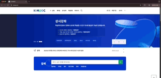
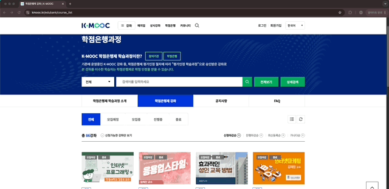
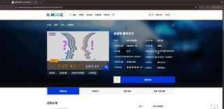
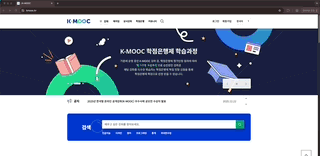
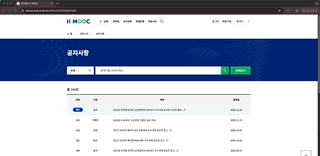

# 프로젝트 개요
### 기존 K-MOOC의 검색 및 추천 한계를 극복하고, 개인화된 학습 경험을 제공하는 플랫폼
<br>
<br>


## 목차
- [프로젝트 개요](#프로젝트-개요)
- [주요 기능](#주요-기능)
- [As-Is / To-Be](#as-is--to-be)
- [기술 스택](#기술-스택)
- [시스템 아키텍쳐](#시스템-아키텍쳐)
- [설계 원칙](#설계-원칙)
- [실행 방법](#실행-방법)
  - [로컬 환경 실행](#1-로컬-환경-실행)
  - [Docker 환경 실행](#2-docker-환경-실행-권장)
- [프로젝트 구조](#프로젝트-구조)
- [API 문서](#api-문서)
- [향후 기술적 개선 방향](#향후-기술적-개선-방향)
- [팀원](#팀원)
- [참고 문서](#참고-문서)

<br>

## 프로젝트 개요

**LIFE-LEARN**은 K-MOOC 플랫폼의 사용자 경험을 개선하고, AI 기반 개인화 추천 시스템을 제공하는 온라인 강좌 학습 플랫폼입니다.

### 핵심 가치 제안

1. **지능형 검색 및 추천**
   - ElasticSearch KNN을 활용한 의미 기반 강좌 검색
   - 사용자 학습 이력 기반 AI 맞춤 강좌 추천
   - 강좌 간 유사도 분석을 통한 연관 강좌 추천

2. **AI 기반 강좌 분석**
   - OpenAI API를 활용한 강좌 리뷰 자동 요약
   - 감성 분석(Sentiment Analysis)을 통한 강좌 평가 지표 제공
   - 자연어 처리 기반 강좌 설명 분석

3. **사용자 중심 커뮤니티**
   - 학습자 간 지식 공유를 위한 게시판
   - 강좌별 Q&A 및 학습 경험 공유
   - 스크랩/좋아요 기능을 통한 콘텐츠 큐레이션

4. **통합 학습 관리**
   - 대시보드를 통한 학습 현황 한눈에 파악
   - 수강 진도 추적 및 이어듣기 기능
   - 위시리스트 및 수강평 관리
  
### 기술적 특징

- **도메인 주도 설계(DDD)**: 앱별 명확한 책임 분리 및 모델 배치
- **성능 최적화**: N+1 쿼리 방지, DB 레벨 집계, 벡터 검색 활용
- **확장 가능한 아키텍쳐**: Aggregation Layer 패턴, RESTful API 설계
- **AI/ML 통합**: 벡터 임베딩, 감성 분석, LLM 기반 콘텐츠 생성

<br>

## 주요 기능

### 1. 인증 및 계정 관리 (Accounts)
- 이메일 기반 회원가입 및 로그인
- Google OAuth 2.0 소셜 로그인
- 토큰 기반 인증 (dj-rest-auth)
- 비밀번호 변경 및 재설정

### 2. 마이페이지 (Mypage)
- 학습 현황 대시보드 (수강중/완료/찜/리뷰 통계)
- 최근 학습 강좌 조회 (이어듣기)
- 수강 강좌 목록 및 상세 정보
- 수강평 등록/수정/삭제 (100자 이상 강제)
- 위시리스트 관리
- 커뮤니티 활동 내역 (작성 글/댓글/스크랩)
- 프로필 관리 (개인정보, 마케팅 동의)

### 3. 커뮤니티 (Community)
- 게시판별 게시글 작성/조회/수정/삭제
- 댓글 및 대댓글 기능
- 좋아요 및 스크랩 기능
- 게시글/댓글 검색 및 필터링
- 실시간 인기 게시글 집계

### 4. 강좌 관리 (Courses)
- 강좌 목록 조회 및 상세 정보
- 카테고리별 강좌 필터링
- 수강 신청 및 진도 관리
- 수강평 작성 및 조회
- 위시리스트 추가/삭제

### 5. 강좌 비교 및 추천 (Comparisons)
- ElasticSearch KNN 기반 강좌 검색
- 강좌 간 유사도 비교
- 사용자 맞춤 강좌 추천
- AI 기반 강좌 리뷰 요약 및 분석

<br>

# As Is  - To Be

### AS Is
| As Is | To Be |
| :---: | :---: |
| 중복 강좌 표시 | 중복 강좌 필터링 |
|  |  |
| 띄어쓰기도 완벽해야하는 검색 | ElasticSearch KNN 의미 기반 검색 |
|  |  |
| 맥락이 적합하지 않은 추천 | 맞춤 강의 추천 |
|  |  |
| 강의 일일이 비교 | AI 강좌 분석 |
|  |  |
| UI/UX | UI/UX 개선 |
|  |  |
| 커뮤니티 | 커뮤니티 |
|  |  |

<br>
<br>

# 팀원
<table>
  <tr>
    <td align="center" width="200px">
      <a href="https://github.com/srogsrogi"> 
      </a>
    </td>
    <td align="center" width="200px">
      <a href="./docs/trouble_shooting/나정현.md"> 
      </a>
    </td>
  </tr>
  <tr>
    <td align="center">
      
      <br />
      <b>강한결</b> <br> (역할)
    </td>
    <td align="center">
      
      <br />
      <b>나정현</b> <br> (담당)
    </td>
  </tr>
</table>

<br>
<br>

# 참고 문서
| 내용 | 링크 |
|---|---|
| 단계별로 구현 과정 중 학습한 내용, 어려웠던 부분, 새로 배운 것들 및 느낀 점을 상세히 기록한 README.md | `backend/apps/{각 앱}/README.md` |
| 데이터베이스 모델링 (ERD) | [ERD 보러가기](docs/erd.md) |
| 추천 알고리즘에 대한 기술적 설명 |  |
| 핵심 기능에 대한 설명 | [기능정의서 보러가기](docs/기능정의서.md) |
| 생성형 AI를 활용한 부분 | [LLM으로 강의 평가하기](./backend/apps/comparisons/management/commands/generate_ai_reviews.py) [임베딩하기]|
| (배포했을 경우) 서비스 URL | [사이트 바로가기](life-learn.site) |
| commit message convention | [커밋 메시지 컨벤션](docs/commit-convention.md) |
| git branch rule | [깃 브랜치 전략](docs/git-branch-rule.md) |

<br>
<br>

# 기술 스택 요약
### Backend
| 분류 | 기술 | 용도 |
|------|------|------|
| **백엔드 프레임워크** | Django 5.2 | 웹 애플리케이션 프레임워크 |
| **API** | Django REST Framework | 3.16.1 | RESTful API 구축 |
| **REST API** | Django REST Framework | API 구축 |
| **인증** | dj-rest-auth | 7.0.1 | 토큰 기반 인증 |
| **소셜 로그인** | django-allauth | 64.0.0 | Google OAuth 2.0 |
| **데이터베이스** | PostgreSQL + pgvector | 0.4.2 | 관계형 DB + 벡터 검색 |
| **검색 엔진** | ElasticSearch | 8.11.1 | 전문 검색 및 KNN 벡터 검색 |
| **AI/ML** | OpenAI API | - | LLM 기반 리뷰 요약/분석 |
| **감성 분석** | scikit-learn | 1.8.0 | 리뷰 감성 분석 |
| **형태소 분석** | kiwipiepy | 0.22.2 | 한국어 자연어 처리 |
| **AI** | AIOps | 프롬프트, 모델명 버전 관리 및 성능 모니터링 |
| **ML** | MLOps | 모델 학습, 평가 커맨드 생성 및 버전 관리 및 성능 모니터링 |
| 감성분석 | sk-learn | 리뷰 감성분석 |
| **API 문서화** | drf-spectacular | 0.29.0 | Swagger/ReDoc 자동 생성 |
| **WSGI 서버** | Gunicorn | latest | 프로덕션 서버 |

### Frontend
| 분류 | 기술 | 용도 |
|------|------|------|
| **프레임워크** | Vue.js | 사용자 인터페이스 |
| **웹 서버** | Nginx | 정적 파일 서빙 및 프록시 |

### Infrastructure
| 분류 | 기술 | 용도 |
|------|------|------|
| **컨테이너화** | Docker | 애플리케이션 컨테이너화 |
| **오케스트레이션** | Docker Compose | 멀티 컨테이너 관리 |
| **환경 변수 관리** | python-dotenv | 환경 설정 관리 |

### 개발 도구
| 분류 | 기술 | 용도 |
|------|------|------|
| **패키지 관리** | pip | Python 패키지 관리 |
| **데이터 처리** | Pandas, NumPy | 데이터 분석 및 전처리 |
| **더미 데이터** | Faker | 테스트 데이터 생성 |


<br>
<br>

## 시스템 아키텍쳐

### 전체 시스템 아키텍쳐

```
┌─────────────────────────────────────────────────────────────────────────┐
│                          Client (Web Browser)                            │
│                           - Vue.js SPA                                   │
└─────────────────────────────────────────────────────────────────────────┘
                                    │ HTTP/HTTPS
                                    ▼
┌─────────────────────────────────────────────────────────────────────────┐
│                        Nginx (Port 80)                                   │
│                  - Static Files Serving                                  │
│                  - Reverse Proxy to Backend                              │
└─────────────────────────────────────────────────────────────────────────┘
                                    │
                    ┌───────────────┴───────────────┐
                    ▼                               ▼
    ┌───────────────────────────┐   ┌────────────────────────────────────┐
    │   Static Files (Vue.js)   │   │   Django Backend (Port 8000)       │
    │   - HTML/CSS/JS           │   │   - Gunicorn WSGI Server           │
    └───────────────────────────┘   │   - Django REST Framework          │
                                    │   - dj-rest-auth / django-allauth  │
                                    └────────────────────────────────────┘
                                                    │
                        ┌───────────────────────────┼───────────────────────────┐
                        ▼                           ▼                           ▼
        ┌───────────────────────────┐   ┌──────────────────────┐   ┌──────────────────────┐
        │   PostgreSQL (Port 5432)  │   │  ElasticSearch       │   │   External APIs      │
        │   - pgvector Extension    │   │  (Port 9200)         │   │   - OpenAI API       │
        │   - 관계형 데이터 저장     │   │  - 전문 검색         │   │   - Google OAuth 2.0 │
        │   - 벡터 임베딩 저장       │   │  - KNN 벡터 검색     │   │                      │
        └───────────────────────────┘   │  - Nori 형태소 분석  │   └──────────────────────┘
                                        └──────────────────────┘
```

### Backend 앱 아키텍쳐 (Django Apps)

```
┌─────────────────────────────────────────────────────────────────────────┐
│                         Django REST Framework                            │
│                        /api/v1/ (API Root)                               │
└─────────────────────────────────────────────────────────────────────────┘
                                    │
        ┌───────────────────────────┼───────────────────────────┐
        │                           │                           │
        ▼                           ▼                           ▼
┌─────────────────┐    ┌─────────────────┐         ┌─────────────────────┐
│  accounts       │    │    mypage       │         │    community        │
│  /accounts/     │    │   /mypage/      │         │   /community/       │
│                 │    │                 │         │                     │
│ - User 모델     │    │ - Aggregation   │         │ - Board, Post       │
│ - 회원가입/로그인│    │   Layer         │         │ - Comment, Scrap    │
│ - Google OAuth  │    │ - 학습 현황     │         │ - 게시판/댓글 관리   │
│ - Token 인증    │    │ - 커뮤니티 활동 │         │ - 좋아요/스크랩     │
└─────────────────┘    │ - 프로필 관리    │         └─────────────────────┘
                       └─────────────────┘
        ▼                           ▲                           ▲
┌─────────────────┐                 │                           │
│   courses       │                 │                           │
│   /courses/     │    ┌────────────┴────────────┐             │
│                 │    │  Domain Models Import   │             │
│ - Course 모델   │    │  - accounts.User        │             │
│ - Enrollment    │◄───┤  - courses.*            │             │
│ - Wishlist      │    │  - community.*          │             │
│ - CourseReview  │    └─────────────────────────┘             │
│ - 강좌 관리     │                                             │
└─────────────────┘                                             │
        ▲                                                       │
        │                                                       │
        │               ┌─────────────────┐                    │
        └───────────────│  comparisons    │────────────────────┘
                        │  /comparisons/  │
                        │                 │
                        │ - ElasticSearch │
                        │ - KNN 벡터 검색 │
                        │ - AI 리뷰 분석  │
                        │ - 강좌 추천     │
                        └─────────────────┘
                                │
                                ▼
                    ┌───────────────────────┐
                    │  ElasticSearch        │
                    │  - 강좌 인덱싱        │
                    │  - 벡터 임베딩        │
                    │  - KNN 유사도 검색    │
                    └───────────────────────┘
```

### 데이터베이스 스키마 구조

```
┌──────────────────────┐
│   accounts_user      │
│  (Django User 확장)  │
├──────────────────────┤
│ PK: id              │
│    username         │
│    email (unique)   │
│    name             │
│    is_email_verified│
└──────────────────────┘
         │ 1
         │
         │ 1:1
         ▼
┌──────────────────────┐       ┌──────────────────────┐
│ accounts_userconsent │       │  courses_course      │
├──────────────────────┤       ├──────────────────────┤
│ PK: id              │       │ PK: id               │
│ FK: user_id         │       │    name              │
│    terms_service    │       │    professor         │
│    privacy_policy   │       │    org_name          │
│    marketing_opt_in │       │    course_image      │
└──────────────────────┘       │    ...               │
                               └──────────────────────┘
                                        │ 1
                                        │
                 ┌──────────────────────┼──────────────────────┐
                 │ *                    │ *                    │ *
                 ▼                      ▼                      ▼
      ┌──────────────────┐   ┌──────────────────┐   ┌──────────────────┐
      │ courses_enrollment│   │ courses_wishlist │   │courses_coursereview│
      ├──────────────────┤   ├──────────────────┤   ├──────────────────┤
      │ PK: id           │   │ PK: id           │   │ PK: id           │
      │ FK: user_id      │   │ FK: user_id      │   │ FK: user_id      │
      │ FK: course_id    │   │ FK: course_id    │   │ FK: course_id    │
      │    status        │   │    created_at    │   │    rating (1-5)  │
      │    progress_rate │   └──────────────────┘   │    review_text   │
      │    last_studied_at│                         │    created_at    │
      └──────────────────┘                         └──────────────────┘
                                                    UNIQUE(user, course)

┌──────────────────────┐       ┌──────────────────────┐
│  community_board     │       │  community_post      │
├──────────────────────┤       ├──────────────────────┤
│ PK: id              │ 1   * │ PK: id               │
│    name             │◄──────│ FK: board_id         │
│    description      │       │ FK: author_id        │
└──────────────────────┘       │    title             │
                               │    content           │
                               │    created_at        │
                               └──────────────────────┘
                                        │ 1
                                        │
                 ┌──────────────────────┼──────────────────────┐
                 │ *                    │ *                    │ *
                 ▼                      ▼                      ▼
      ┌──────────────────┐   ┌──────────────────┐   ┌──────────────────┐
      │community_comment │   │ community_scrap  │   │ post_likes (M2M) │
      ├──────────────────┤   ├──────────────────┤   ├──────────────────┤
      │ PK: id           │   │ PK: id           │   │ FK: post_id      │
      │ FK: post_id      │   │ FK: user_id      │   │ FK: user_id      │
      │ FK: author_id    │   │ FK: post_id      │   └──────────────────┘
      │ FK: parent_id    │   │    created_at    │
      │    content       │   └──────────────────┘
      │    created_at    │   UNIQUE(user, post)
      └──────────────────┘
```

<br>

## 설계 원칙

### 1. 도메인 주도 설계 (Domain-Driven Design)

**원칙**: 각 앱은 명확한 도메인 책임을 가지며, 도메인의 주체가 되는 모델을 소유한다.

**적용 사례**:
- `accounts`: User, UserConsent 모델 소유 (사용자 인증/프로필 관리)
- `courses`: Course, Enrollment, Wishlist, CourseReview 모델 소유 (강좌 관리)
- `community`: Board, Post, Comment, Scrap 모델 소유 (커뮤니티 기능)
- `comparisons`: ElasticSearch 연동 및 AI 분석 (검색/추천)
- `mypage`: 모델 없음 - Aggregation Layer로 사용자 중심 데이터 집계

**효과**:
- 순환 참조(Circular Dependency) 방지
- 데이터 소유권 명확화
- 앱 간 결합도 감소

---

### 2. Aggregation Layer 패턴

**원칙**: mypage 앱은 독자적인 모델을 가지지 않고, 여러 도메인 데이터를 사용자 관점으로 집계한다.

**적용 사례**:
```python
# mypage 앱은 다른 앱의 모델을 Import하여 조회만 수행
from apps.accounts.models import User, UserConsent
from apps.courses.models import Course, Enrollment, Wishlist
from apps.community.models import Post, Comment, Scrap
```

**효과**:
- 데이터 중복 방지 (Single Source of Truth)
- 비즈니스 로직은 도메인 앱에만 존재
- 마이페이지는 조회(Query)와 응답(Response) 책임만 담당

---

### 3. 성능 최적화 우선

**원칙**: N+1 쿼리 방지 및 DB 레벨 집계를 통한 성능 최적화

**적용 기법**:

1. **select_related (JOIN 최적화)**
```python
# FK 관계 미리 조인
Enrollment.objects.filter(user=user).select_related('course')
```

2. **prefetch_related (ManyToMany 최적화)**
```python
# ManyToMany 관계 일괄 조회
Scrap.objects.filter(user=user).prefetch_related('post__likes', 'post__comments')
```

3. **aggregate/annotate (DB 레벨 집계)**
```python
# Python 루프 대신 DB에서 직접 집계
Enrollment.objects.filter(user=user).aggregate(
    enrolled_count=Count('id', filter=Q(status='enrolled')),
    completed_count=Count('id', filter=Q(status='completed'))
)
```

**효과**:
- 쿼리 수 최소화 (N+1 문제 해결)
- 응답 시간 단축
- 서버 부하 감소

---

### 4. RESTful API 설계

**원칙**: HTTP 메서드와 상태 코드를 의미에 맞게 사용

**URL 구조**:
```
/api/v1/{app_name}/{resource}/
/api/v1/courses/                   # 강좌 목록
/api/v1/courses/{id}/              # 강좌 상세
/api/v1/mypage/dashboard/stats/    # 대시보드 통계
```

**상태 코드 규칙**:
- `200 OK`: 조회/수정 성공
- `201 Created`: 신규 생성
- `204 No Content`: 삭제 성공
- `400 Bad Request`: 입력 검증 실패
- `401 Unauthorized`: 인증 실패
- `403 Forbidden`: 권한 없음
- `404 Not Found`: 리소스 없음

**효과**:
- API 일관성 향상
- 클라이언트 구현 간소화
- 문서화 용이성

---

### 5. Serializer 레벨 검증

**원칙**: 입력 검증 로직은 Serializer에서 처리하고, View는 저장 로직에만 집중

**적용 사례**:
```python
# Serializer에서 검증
class CourseReviewSerializer(serializers.ModelSerializer):
    def validate_rating(self, value):
        if not (1 <= value <= 5):
            raise serializers.ValidationError("평점은 1~5 사이여야 합니다.")
        return value

    def validate_review_text(self, value):
        if len(value.strip()) < 100:
            raise serializers.ValidationError("리뷰는 100자 이상 작성해주세요.")
        return value

# View는 저장만 담당
class CourseReviewView(APIView):
    def post(self, request, course_id):
        serializer = CourseReviewSerializer(data=request.data)
        serializer.is_valid(raise_exception=True)  # 검증
        review = serializer.save(user=request.user)  # 저장
        return Response(serializer.data)
```

**효과**:
- 관심사 분리 (Separation of Concerns)
- 코드 재사용성 향상
- 테스트 용이성

---

### 6. 방어적 인증 설계

**원칙**: 전역 permission 정책과 무관하게, 민감한 데이터 API는 명시적으로 인증 요구

**적용 사례**:
```python
# 전역 설정이 있어도 View 레벨에서 재선언
class DashboardStatsView(APIView):
    permission_classes = [IsAuthenticated]  # 명시적 선언

    def get(self, request):
        user = request.user
        # ...
```

**효과**:
- 보안 강화
- 개인정보 보호
- 전역 정책 변경에 영향 최소화

---

### 7. ElasticSearch 활용 전략

**원칙**: 전문 검색 및 벡터 유사도 검색은 ElasticSearch에 위임

**적용 기법**:
1. **전문 검색 (Full-text Search)**
   - Nori 형태소 분석기를 통한 한국어 검색 최적화
   - 강좌명, 교수명, 기관명, 설명 등 복합 검색

2. **벡터 검색 (KNN)**
   - 강좌 설명을 벡터로 임베딩
   - 코사인 유사도 기반 추천

3. **하이브리드 검색**
   - 전문 검색 + KNN 검색 결과 통합
   - 가중치 조절을 통한 검색 품질 향상

**효과**:
- 검색 품질 향상
- 응답 속도 개선
- 확장성 확보

---

### 8. AI/ML 파이프라인 분리

**원칙**: AI/ML 로직은 Management Command로 분리하여 비동기 처리

**적용 사례**:
```bash
# AI 리뷰 생성 (OpenAI API)
python manage.py generate_ai_reviews

# 강좌 데이터 ElasticSearch 인덱싱
python manage.py index_courses

# 감성 분석 모델 학습
python manage.py train_sentiment_model
```

**효과**:
- 웹 요청과 AI 처리 분리
- 배치 처리 가능
- 실패 시 재시도 용이

<br>

---

## 실행 방법

### 사전 요구사항

- **로컬 실행**: Python 3.11+, PostgreSQL, ElasticSearch
- **Docker 실행**: Docker, Docker Compose

---

### 1. 로컬 환경 실행

#### 1.1 환경 변수 설정

```bash
# 프로젝트 루트에서 .env 파일 생성
cp .env.example .env
```

`.env` 파일 예시:
```env
# Django 설정
SECRET_KEY=your-secret-key-here
DJANGO_SETTINGS_MODULE=config.settings

# Google OAuth 2.0
GOOGLE_CLIENT_ID=your-google-client-id
GOOGLE_SECRET_KEY=your-google-secret-key

# PostgreSQL
POSTGRES_DB=moduway_db
POSTGRES_USER=postgres
POSTGRES_PASSWORD=your-password
POSTGRES_HOST=localhost
POSTGRES_PORT=5432

# ElasticSearch
ES_URL=http://localhost:9200

# 타임존
TZ=Asia/Seoul
```

#### 1.2 PostgreSQL 설치 및 설정

```bash
# macOS (Homebrew)
brew install postgresql@14
brew services start postgresql@14

# Ubuntu/Debian
sudo apt-get install postgresql postgresql-contrib

# PostgreSQL 데이터베이스 생성
psql -U postgres
CREATE DATABASE moduway_db;
CREATE EXTENSION vector;  # pgvector 확장 설치
\q
```

#### 1.3 ElasticSearch 설치 및 실행

```bash
# macOS (Homebrew)
brew install elasticsearch
brew services start elasticsearch

# Ubuntu/Debian
wget https://artifacts.elastic.co/downloads/elasticsearch/elasticsearch-8.11.1-linux-x86_64.tar.gz
tar -xzf elasticsearch-8.11.1-linux-x86_64.tar.gz
cd elasticsearch-8.11.1/
./bin/elasticsearch

# Nori 형태소 분석기 설치
./bin/elasticsearch-plugin install analysis-nori
```

#### 1.4 Backend 실행

```bash
# 백엔드 디렉토리 이동
cd backend

# 가상환경 생성 및 활성화
python -m venv venv
source venv/bin/activate  # Windows: venv\Scripts\activate

# 의존성 설치
pip install -r requirements.txt

# 데이터베이스 마이그레이션
python manage.py makemigrations
python manage.py migrate

# Google OAuth 설정 (자동 Site 생성)
python manage.py setup_google_auth

# 강좌 데이터 로드 (선택사항)
python manage.py load_courses /path/to/course_data.csv

# ElasticSearch 인덱싱 (선택사항)
python manage.py index_courses

# 개발 서버 실행
python manage.py runserver
```

서버 접속: `http://localhost:8000`

#### 1.5 Frontend 실행

```bash
# 프론트엔드 디렉토리 이동
cd frontend/project-moduway

# 의존성 설치
npm install

# 개발 서버 실행
npm run dev
```

프론트엔드 접속: `http://localhost:3000` (또는 Vue.js 설정에 따라)

---

### 2. Docker 환경 실행 (권장)

Docker를 사용하면 복잡한 환경 설정 없이 한 번에 실행할 수 있습니다.

#### 2.1 환경 변수 설정

```bash
# 프로젝트 루트에서 .env 파일 생성
cp .env.example .env
```

`.env` 파일 예시 (Docker 환경):
```env
# Django 설정
SECRET_KEY=your-secret-key-here
DJANGO_SETTINGS_MODULE=config.settings

# Google OAuth 2.0
GOOGLE_CLIENT_ID=your-google-client-id
GOOGLE_SECRET_KEY=your-google-secret-key

# PostgreSQL (Docker 컨테이너)
POSTGRES_DB=moduway_db
POSTGRES_USER=postgres
POSTGRES_PASSWORD=your-password
POSTGRES_HOST=db  # Docker Compose 서비스 이름
POSTGRES_PORT=5432

# ElasticSearch (Docker 컨테이너)
ES_URL=http://elasticsearch:9200

# 타임존
TZ=Asia/Seoul
```

#### 2.2 Docker Compose 실행

```bash
# 프로젝트 루트에서 실행
docker-compose up -d

# 로그 확인
docker-compose logs -f

# 특정 서비스 로그만 확인
docker-compose logs -f backend
```

#### 2.3 컨테이너 구성

Docker Compose는 다음 서비스를 자동으로 실행합니다:

1. **db** (PostgreSQL + pgvector)
   - Port: 5432
   - 자동으로 vector 확장 설치

2. **elasticsearch**
   - Port: 9200
   - Nori 형태소 분석기 자동 설치
   - 메모리: 8GB 할당

3. **backend** (Django)
   - Port: 8000
   - Gunicorn WSGI 서버
   - 자동 마이그레이션 수행

4. **frontend** (Vue.js + Nginx)
   - Port: 80
   - Nginx로 정적 파일 서빙

#### 2.4 초기 데이터 로드 (선택사항)

```bash
# Backend 컨테이너에 접속
docker-compose exec backend bash

# 강좌 데이터 로드
python manage.py load_courses /data/course_data.csv

# ElasticSearch 인덱싱
python manage.py index_courses

# AI 리뷰 생성 (OpenAI API 필요)
python manage.py generate_ai_reviews

# 테스트 데이터 생성
python manage.py load_custom_seeds

# 컨테이너에서 나가기
exit
```

#### 2.5 서비스 접속

- **프론트엔드**: `http://localhost`
- **백엔드 API**: `http://localhost:8000`
- **API 문서 (Swagger)**: `http://localhost:8000/api/schema/swagger-ui/`
- **API 문서 (ReDoc)**: `http://localhost:8000/api/schema/redoc/`
- **ElasticSearch**: `http://localhost:9200`

#### 2.6 Docker 서비스 관리

```bash
# 모든 서비스 중지
docker-compose stop

# 모든 서비스 재시작
docker-compose restart

# 특정 서비스만 재시작
docker-compose restart backend

# 모든 서비스 및 볼륨 삭제 (주의: 데이터 손실)
docker-compose down -v

# 이미지 재빌드
docker-compose build

# 재빌드 후 실행
docker-compose up -d --build
```

---

### 3. 주요 Management Commands

#### 3.1 강좌 데이터 관리

```bash
# 강좌 데이터 로드
python manage.py load_courses /path/to/course_data.csv

# ElasticSearch 인덱싱
python manage.py index_courses

# 강좌 데이터 업데이트
python manage.py update_courses
```

#### 3.2 AI/ML 관련

```bash
# AI 리뷰 생성 (OpenAI API)
python manage.py generate_ai_reviews

# 감성 분석 모델 학습
python manage.py train_sentiment_model

# 강좌 임베딩 생성
python manage.py generate_embeddings
```

#### 3.3 테스트 데이터 생성

```bash
# 활성 유저 시뮬레이션 데이터 생성
python manage.py load_custom_seeds

# 더미 데이터 생성 (Faker)
python manage.py generate_fake_data
```

#### 3.4 인증 설정

```bash
# Google OAuth 자동 설정
python manage.py setup_google_auth
```

## 프로젝트 구조

```
project-moduway/
│
├── backend/                      # Django Backend
│   ├── apps/                     # Django Apps
│   │   ├── accounts/             # 인증 및 계정 관리
│   │   │   ├── models.py         # User, UserConsent
│   │   │   ├── serializers.py    # 회원가입/로그인 Serializer
│   │   │   ├── views.py          # 인증 API
│   │   │   ├── urls.py
│   │   │   └── README.md         # 앱별 상세 문서
│   │   │
│   │   ├── mypage/               # 마이페이지 (Aggregation Layer)
│   │   │   ├── models.py         # 모델 없음
│   │   │   ├── serializers.py    # 집계 데이터 Serializer
│   │   │   ├── views.py          # 통계/목록 API
│   │   │   ├── urls.py
│   │   │   └── README.md
│   │   │
│   │   ├── community/            # 커뮤니티
│   │   │   ├── models.py         # Board, Post, Comment, Scrap
│   │   │   ├── serializers.py
│   │   │   ├── views.py          # 게시판/댓글 API
│   │   │   ├── urls.py
│   │   │   └── README.md
│   │   │
│   │   ├── courses/              # 강좌 관리
│   │   │   ├── models.py         # Course, Enrollment, Wishlist, Review
│   │   │   ├── serializers.py
│   │   │   ├── views.py          # 강좌/수강 API
│   │   │   ├── urls.py
│   │   │   ├── management/       # Management Commands
│   │   │   │   └── commands/
│   │   │   │       ├── load_courses.py
│   │   │   │       └── index_courses.py
│   │   │   └── README.md
│   │   │
│   │   ├── comparisons/          # 강좌 비교 및 추천
│   │   │   ├── models.py         # ElasticSearch 연동
│   │   │   ├── serializers.py
│   │   │   ├── views.py          # 검색/추천 API
│   │   │   ├── urls.py
│   │   │   ├── management/
│   │   │   │   └── commands/
│   │   │   │       ├── generate_ai_reviews.py  # OpenAI API
│   │   │   │       └── train_sentiment_model.py
│   │   │   └── README.md
│   │   │
│   │   └── core/                 # 공통 커맨드 및 유틸리티
│   │       └── management/
│   │           └── commands/
│   │               ├── load_custom_seeds.py
│   │               └── setup_google_auth.py
│   │
│   ├── config/                   # Django 설정
│   │   ├── settings.py           # 프로젝트 설정
│   │   ├── urls.py               # 메인 URL 라우팅
│   │   └── wsgi.py
│   │
│   ├── requirements.txt          # Python 의존성
│   ├── Dockerfile                # Backend Docker 이미지
│   └── manage.py
│
├── frontend/                     # Vue.js Frontend
│   └── project-moduway/
│       ├── src/
│       ├── public/
│       ├── Dockerfile            # Frontend Docker 이미지
│       └── package.json
│
├── data/                         # 데이터 파일
│   └── course_data.csv
│
├── docs/                         # 문서
│   ├── images/
│   ├── erd.md                    # ERD 다이어그램
│   ├── 기능정의서.md              # 기능 명세
│   ├── api설계.md                 # API 설계
│   ├── commit-convention.md      # 커밋 컨벤션
│   └── git-branch-rule.md        # Git 브랜치 전략
│
├── docker-compose.yml            # Docker Compose 설정
├── .env.example                  # 환경 변수 예시
├── .gitignore
└── README.md                     # 본 문서
```

<br>

---

## API 문서

### Swagger UI (Interactive API Docs)
- URL: `http://localhost:8000/api/schema/swagger-ui/`
- 모든 API 엔드포인트를 대화형으로 테스트 가능

### ReDoc (API Documentation)
- URL: `http://localhost:8000/api/schema/redoc/`
- 읽기 편한 형식의 API 문서

### API 설계 문서
- 파일: `docs/api설계.md`
- 앱별 상세 API 명세 포함

<br>

---

## 향후 기술적 개선 방향

### 1. CI/CD 파이프라인 구축

**목표**: 자동화된 테스트 및 배포 프로세스 구축

**구현 계획**:
- **GitHub Actions** 활용
  - Push/PR 시 자동 테스트 실행 (pytest, coverage)
  - 코드 품질 검사 (flake8, black, isort)
  - 보안 취약점 스캔 (bandit, safety)

- **자동 배포**
  - main 브랜치 병합 시 자동 배포 (AWS ECS, GCP Cloud Run 등)
  - Docker 이미지 자동 빌드 및 푸시
  - 블루-그린 배포 전략 적용

**기대 효과**:
- 배포 시간 단축 (수동 → 자동)
- 휴먼 에러 감소
- 코드 품질 향상

---

### 2. Apache Airflow 데이터 파이프라인

**목표**: 강좌 데이터 적재 및 AI 처리 자동화

**구현 계획**:
- **DAG 구성**
  ```
  [K-MOOC 크롤링] → [데이터 전처리] → [DB 저장] → [ElasticSearch 인덱싱] → [AI 리뷰 생성]
  ```

- **스케줄링**
  - 일일 1회 K-MOOC 강좌 데이터 수집 (새벽 2시)
  - 주간 1회 AI 리뷰 업데이트 (일요일 새벽 3시)
  - 월간 1회 감성 분석 모델 재학습 (매월 1일)

- **모니터링**
  - Airflow UI를 통한 DAG 실행 현황 확인
  - 실패 시 Slack/Email 알림
  - 재시도 정책 설정

**기대 효과**:
- 데이터 최신성 유지
- 수동 작업 제거
- 에러 추적 용이

---

### 3. MLOps 및 AIOps 도입

**목표**: AI/ML 모델의 버전 관리 및 성능 모니터링

**MLflow 도입**:
- **실험 관리**
  - 하이퍼파라미터 추적
  - 모델 성능 메트릭 기록
  - 모델 버전 관리

- **모델 레지스트리**
  - 프로덕션 모델 중앙 관리
  - A/B 테스트 지원
  - 모델 롤백 기능

**Grafana + Prometheus 도입**:
- **성능 모니터링**
  - API 응답 시간
  - ElasticSearch 쿼리 성능
  - 데이터베이스 쿼리 성능
  - AI 모델 추론 시간

- **대시보드 구성**
  - 실시간 트래픽 모니터링
  - 에러율 추적
  - 사용자 행동 분석

**기대 효과**:
- 모델 성능 저하 조기 발견
- 실험 재현성 확보
- 데이터 드리븐 의사결정

---

### 4. 캐싱 전략 개선

**목표**: Redis를 활용한 응답 속도 개선

**구현 계획**:
- **API 캐싱**
  - 마이페이지 통계 (TTL: 5분)
  - 강좌 목록 (TTL: 1시간)
  - 인기 게시글 (TTL: 10분)

- **세션 캐싱**
  - Django Session을 Redis에 저장
  - 토큰 블랙리스트 (로그아웃 시)

- **ElasticSearch 결과 캐싱**
  - 인기 검색어 결과 (TTL: 30분)
  - 추천 강좌 (TTL: 1시간)

**기대 효과**:
- API 응답 시간 50% 단축
- 데이터베이스 부하 감소
- 사용자 경험 개선

---

### 5. 비동기 처리 (Celery)

**목표**: 무거운 작업의 비동기 처리로 응답 속도 개선

**구현 계획**:
- **Task Queue 구성**
  - Celery + Redis
  - 우선순위 큐 분리 (high, default, low)

- **비동기 Task**
  - AI 리뷰 생성 (OpenAI API 호출)
  - 이메일 발송 (회원가입, 비밀번호 재설정)
  - ElasticSearch 인덱싱
  - 감성 분석 배치 처리

- **스케줄링**
  - Celery Beat를 통한 주기적 작업
  - 인기 게시글 집계 (10분마다)
  - 강좌 통계 업데이트 (1시간마다)

**기대 효과**:
- API 응답 시간 개선 (동기 → 비동기)
- 서버 안정성 향상
- 사용자 대기 시간 감소

---

### 6. 검색 품질 개선

**목표**: ElasticSearch 활용도 극대화

**구현 계획**:
- **검색 쿼리 최적화**
  - Multi-match 쿼리 가중치 조정
  - Fuzzy 검색으로 오타 허용
  - 동의어 사전 구축 (예: "파이썬" ↔ "Python")

- **검색 결과 개인화**
  - 사용자 학습 이력 기반 가중치
  - 최근 검색 이력 반영
  - 인기 강좌 부스팅

- **자동완성 (Autocomplete)**
  - Edge N-gram Tokenizer 활용
  - 검색어 제안 기능

**기대 효과**:
- 검색 만족도 향상
- 강좌 발견율 증가
- 사용자 참여도 증가

---

### 7. 보안 강화

**목표**: 프로덕션 환경 보안 수준 향상

**구현 계획**:
- **HTTPS 적용**
  - Let's Encrypt SSL 인증서
  - HSTS (HTTP Strict Transport Security)

- **보안 헤더 추가**
  - X-Frame-Options: DENY
  - X-Content-Type-Options: nosniff
  - CSP (Content Security Policy)

- **Rate Limiting**
  - API 호출 횟수 제한 (django-ratelimit)
  - DDoS 방어

- **입력 검증 강화**
  - XSS 방지 (django-bleach)
  - SQL Injection 방지 (ORM 활용)

**기대 효과**:
- 보안 취약점 감소
- 악의적 공격 방어
- 사용자 신뢰도 향상

---
### 8. 테스트 커버리지 확대

**목표**: 안정적인 코드베이스 구축

**구현 계획**:
- **단위 테스트 (Unit Test)**
  - 모델 테스트 (Django TestCase)
  - Serializer 검증 로직 테스트
  - View 로직 테스트 (APITestCase)

- **통합 테스트 (Integration Test)**
  - API 엔드포인트 테스트
  - 인증 플로우 테스트
  - 트랜잭션 테스트

- **부하 테스트 (Load Test)**
  - Locust를 통한 부하 테스트
  - 동시 사용자 시뮬레이션
  - 병목 지점 파악

**목표 커버리지**: 80% 이상

**기대 효과**:
- 버그 조기 발견
- 리팩토링 안정성 확보
- 코드 품질 향상

---

### 9. 프론트엔드 최적화

**목표**: Vue.js 애플리케이션 성능 개선

**구현 계획**:
- **코드 스플리팅 (Code Splitting)**
  - 라우트별 Lazy Loading
  - 번들 크기 최소화

- **상태 관리 최적화**
  - Vuex/Pinia 적극 활용
  - 불필요한 API 호출 제거

- **이미지 최적화**
  - WebP 포맷 적용
  - Lazy Loading
  - CDN 활용

**기대 효과**:
- 초기 로딩 시간 단축
- 사용자 경험 개선
- SEO 점수 향상

---

### 10. 로깅 및 모니터링 체계화

**목표**: 프로덕션 환경 디버깅 및 모니터링

**구현 계획**:
- **중앙 로그 관리**
  - ELK Stack (Elasticsearch, Logstash, Kibana)
  - 애플리케이션 로그 통합
  - 에러 트래킹 (Sentry)

- **APM (Application Performance Monitoring)**
  - New Relic / DataDog
  - 트랜잭션 추적
  - 슬로우 쿼리 탐지

- **알림 시스템**
  - Slack 통합
  - 에러율 임계값 알림
  - 서버 리소스 모니터링

**기대 효과**:
- 장애 대응 시간 단축
- 성능 병목 지점 파악
- 사용자 행동 분석

<br>
